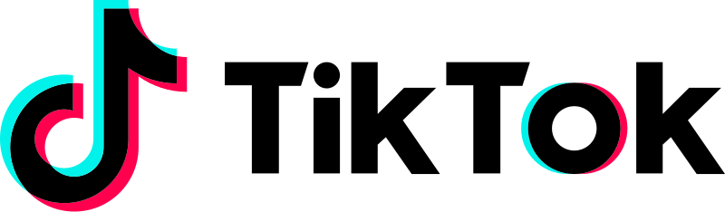

<div id="top"></div>
<!--
*** Thanks for checking out the Best-README-Template. If you have a suggestion
*** that would make this better, please fork the repo and create a pull request
*** or simply open an issue with the tag "enhancement".
*** Don't forget to give the project a star!
*** Thanks again! Now go create something AMAZING! :D
-->

<!-- PROJECT SHIELDS -->
<!--
*** I'm using markdown "reference style" links for readability.
*** Reference links are enclosed in brackets [ ] instead of parentheses ( ).
*** See the bottom of this document for the declaration of the reference variables
*** for contributors-url, forks-url, etc. This is an optional, concise syntax you may use.
*** https://www.markdownguide.org/basic-syntax/#reference-style-links
-->

<!-- PROJECT LOGO -->
<br />
<section align="center">
  <a href="#">
    
  </a>

  <h3 align="center">TikTok Clone</h3>

  <article align="center">
    A simplified version of the popular <a href="https://www.tiktok.com/" target="_blank">TikTok social media application</a>
    <br>
    <br>
    <a href="#">👉 View Demo 👈</a>
  </article>
</section>

<br>
    
![Product Name Screen Shot][homepage-screenshot]

<!-- TABLE OF CONTENTS -->
<details>
  <summary>Table of Contents</summary>
  <ol>
    <li>
      <a href="#about-the-project">About The Project</a>
      <ul>
        <li><a href="#built-with">Built With</a></li>
      </ul>
    </li>
    <li>
      <a href="#getting-started">Getting Started</a>
      <ul>
        <li><a href="#prerequisites">Prerequisites</a></li>
        <li><a href="#installation">Installation</a></li>
      </ul>
    </li>
  </ol>
</details>

<!-- ABOUT THE PROJECT -->

## About The Project

This TikTok clone is an exercise in building a social media application, built in Next.js with the headless CMS Sanity as a backend.

### Main Features

☑️ Google OAuth
<br>
☑️ Upload Videos
<br>
☑️ Comment on Posts

<p align="right">(<a href="#top">back to top</a>)</p>

## Tech Stack

[![Next][next.js]][next-url]
[![React][react.js]][react-url]
[![Typescript][typescript]][typescript-url]
[![Sanity][sanity]][sanity-url]

<p align="right">(<a href="#top">back to top</a>)</p>

## Installation

_Follow the steps to setup the project locally_

1. Clone the repo
   ```sh
   git clone https://github.com/NoerGitKat/tiktokclone-ts
   ```
2. Install NPM packages
   ```sh
   npm install
   cd backend-tiktokclone && npm install
   ```
3. Enter API keys in `.env.development`
   ```md
   NEXT_PUBLIC_API_BASE_URL=
   NEXT_PUBLIC_SANITY_TOKEN=
   NEXT_PUBLIC_SANITY_PROJECT_ID=
   NEXT_PUBLIC_GOOGLE_CLIENT_ID=
   ```
4. Start project
   ```sh
   npm run dev
   ```

<p align="right">(<a href="#top">back to top</a>)</p>

<!-- CONTACT -->

## Contact

Noer Paanakker - [LinkedIn](https://www.linkedin.com/in/noer-paanakker-731284a1/) - noer@lightworksweb.nl

Project Link: [https://github.com/your_username/repo_name](https://github.com/your_username/repo_name)

<p align="right">(<a href="#top">back to top</a>)</p>

<!-- MARKDOWN LINKS & IMAGES -->
<!-- https://www.markdownguide.org/basic-syntax/#reference-style-links -->

[homepage-screenshot]: public/homepage.png
[next.js]: https://img.shields.io/badge/next.js-000000?style=for-the-badge&logo=nextdotjs&logoColor=white
[next-url]: https://nextjs.org/
[react.js]: https://img.shields.io/badge/React-20232A?style=for-the-badge&logo=react&logoColor=61DAFB
[react-url]: https://reactjs.org/
[typescript]: https://img.shields.io/badge/typescript-B0397A?style=for-the-badge&logo=typescript&logoColor=61DAFB
[typescript-url]: https://www.typescriptlang.org/
[sanity]: https://img.shields.io/badge/sanity-2D432A?style=for-the-badge&logo=cms&logoColor=61DAFB
[sanity-url]: https://www.sanity.io/
